**Objective:** Udacity Capstone Project for Predictive Analysis

## Task 1: Store Format for Existing Stores
### Problem Statement
A grocery company has 85 stores and planning to open 10 new stores at the beginning of the year.
### Current Business Environment
All current stores have a single design and are cared for in the same manner. These stores receive the same amount of products, regardless of sales and their unique customer shopping habits.
### Task
To analyze sales and decide on store format and more tailored inventory plans
### Analysis
**Software Tools** Alteryx

Q1 What is the optimal number of store formats?
We believe the optimal number of store formats to create is 3 types.
Using the k-means cluster model and examining both the Adjusted Rand (AR) and Calinski-Harabasz(CH) indices, each index suggests a slightly different number of clusters to create. These individual clusters represent the number of formats that the stores can be grouped. AR index suggests 3 clusters as the optimal number as it has the highest mean value. CH index, on the other hand, suggests 2 clusters but it also shows a lot more outliers. Therefore, we chose 3 clusters as it is more compact.

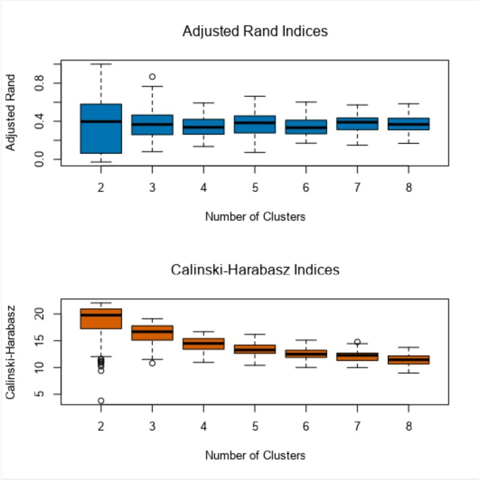

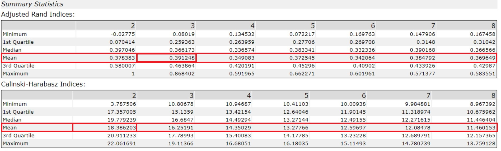

Q2 How many stores are allocated in each cluster?

-Cluster 1: 23 stores
-Cluster 2: 29 stores
-Cluster 3: 33 stores

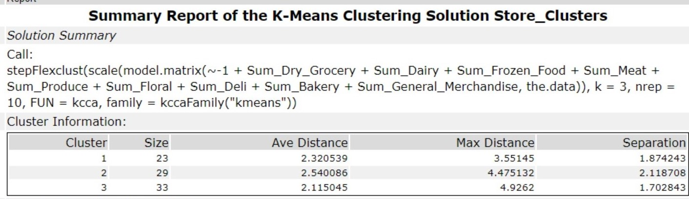

Q3 What are the characteristics of each cluster?
Our analysis suggests 3 types of store formats with there unique characteristics.
Cluster 1: This format sells the most general merchandise, and doesn’t sell dairy or Bakery items
Cluster 2: These stores sell mostly dairy, produce and floral items, but not a lot of deli or dry grocery goods.
Cluster 3: Sells mostly meat and deli items

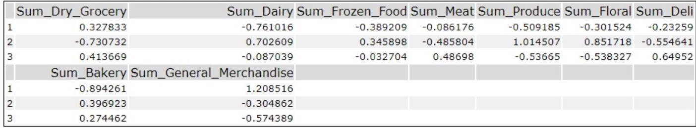

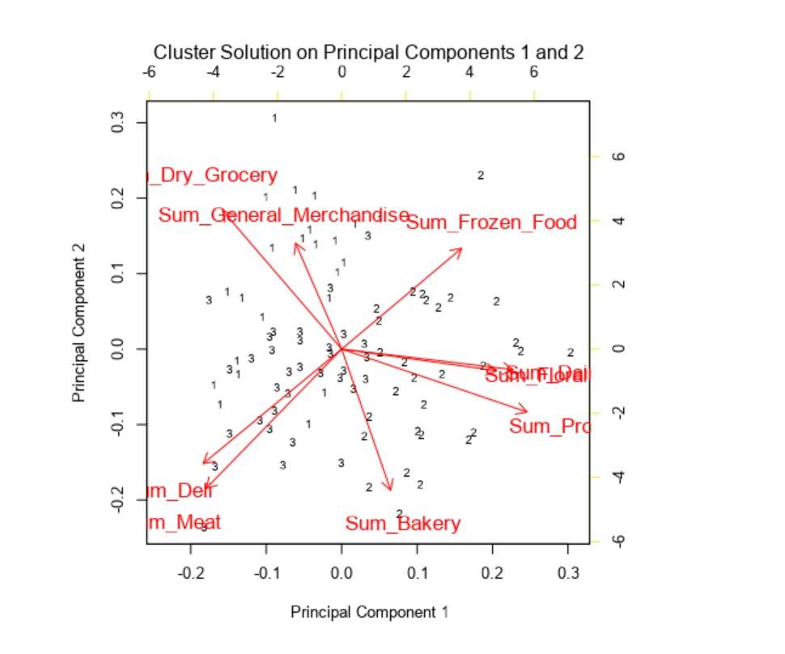

Q4 Show a Tableau visualization of the existing stores' locations and associated clusters

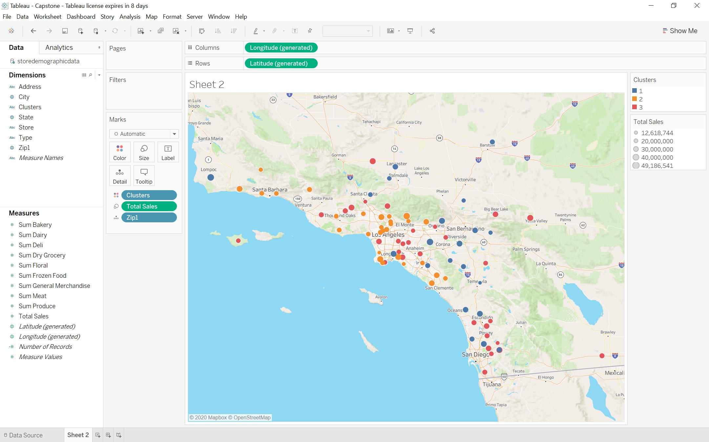

Task 2: New Stores

Q1 What methodology did you use to predict that best store format for the new stores?
Three different models were built to predict the cluster classification of the new stores
The models:
Decision Tree: A statistically predictive model
Forest Model: An ensemble random model
Boosted Model: A generalize boosted regression model based on the gradient boosting methods

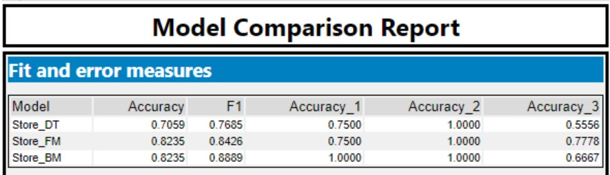

The Model Comparison Report suggests boosted and forest model as good predictors as they both scored an 82.3% accuracy rate. There is another measurement to consider, the F1 score. It is a harmonic mean which takes into account both precision and recall. It is a score that helps evaluate multiclass-classification, with 1 indicating perfect precision and recall(4).
The F1-score shows that the boosted model is slightly better at predicting the formats of the existing stores.

Q2 What is the new store classification?

|**Store Number**|**Segment**|
|---|---|
|S0086 | 3 |
|S0087 | 2 |
|S0088 | 1 |
|S0089 | 2 |
|S0090 | 2 |
|S0091 | 1 |
|S0092 | 2 |
|S0093 | 1 |
|S0094 | 2 |
|S0095 | 2 |

##Task 3: Predicting Produce Sales

Q1 What type of ETS or ARIMA model did you use for each forecast? Use ETS(a,m,n) or ARIMA(ar, i, ma) notation. How did you come to that decision?
We chose to apply the ETS(M,N,M) over ARIMA(1,0,0)(1,1,0) , even though ARIMA has a better score with the external validation measure and ETS has performed better in the internal validation.

Internal Validation:
This is an in-sample error measures, that help us understand how well a model performed, but we cannot use these measurements to compare two different models. Looking at RMSE (Root-Mean-Square Error) we see that ETS model has a more compact fit, its residual error is closer to the mean. Both ETS and ARIMA as a MASE(Mean Absolute Scaled Error) less than 1, this a relative value and it represent the relative reduction in error compared to a naive model.

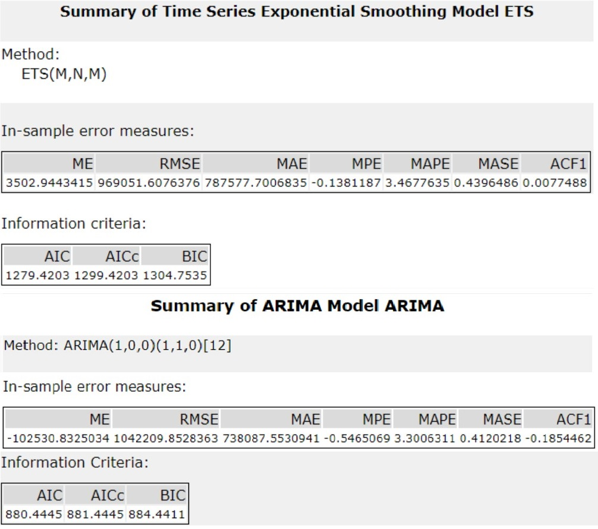

External Validation:
This is measure determines the accuracy against a holdout sample. Looking at the Akaike Information Criterion (AIC) we see that ARIMA has a lower value, which is an indication that it might has a better prediction score.

But once we run TS Compare tool we see ETS actually performs better.

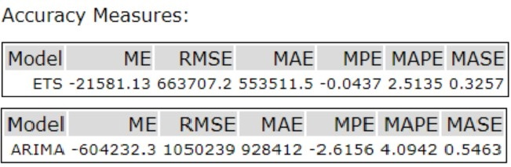

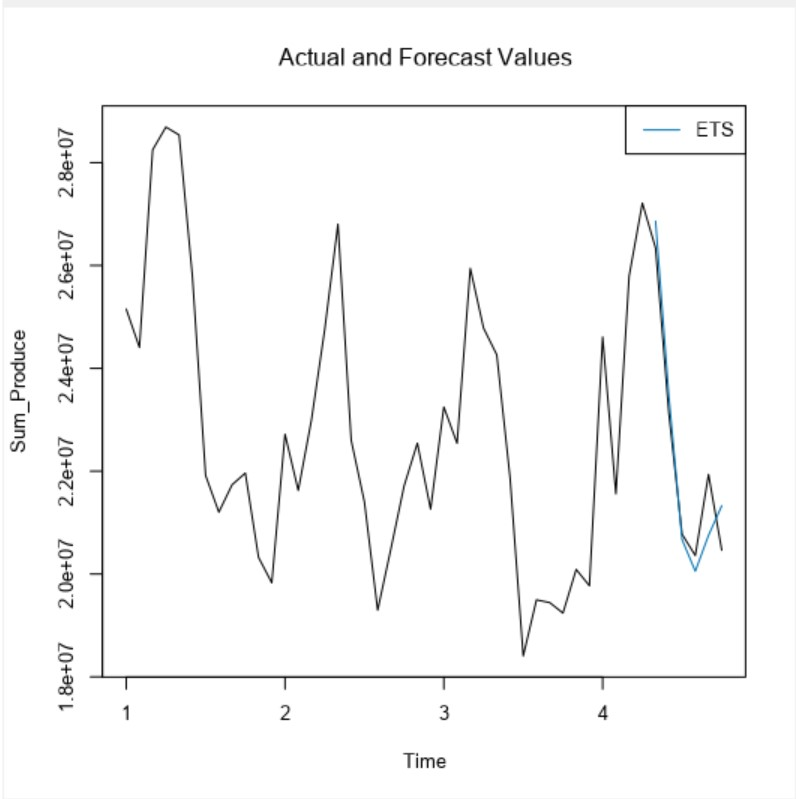

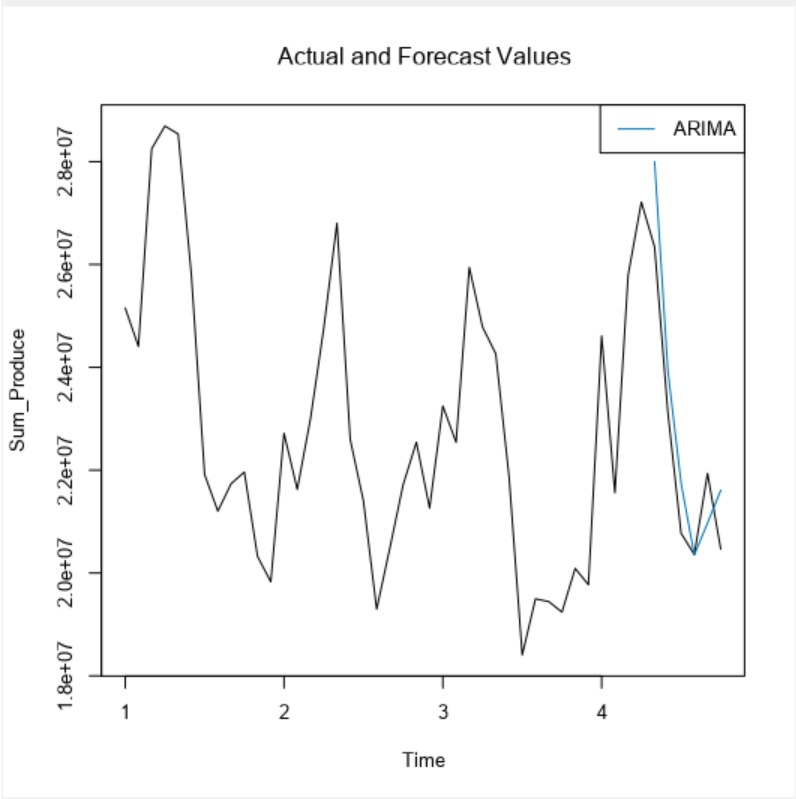

Q2 provide a table of your forecasts for existing and new stores. Also, provide visualization of your forecasts that includes historical data, existing stores forecasts, and new stores forecasts.

| **Month** | **New Store Sales** |**Existing Store Sales**|
|---|---|---|
| 16-Jan | $2,919,067.02 | $23,506,565.98 |
| 16-Feb | $2,797,280.08 | $22,208,405.76 |
| 16-Mar | $3,163,764.86 | $25,380,147.77 |
| 16-Apr | $3,202,813.29 | $25,966,799.47 |
| 16-May | $3,228,212.24 | $26,113,792.57 |
| 16-Jun | $2,868,914.81 | $22,899,285.77 |
| 16-Jul | $2,538,372.27 | $20,499,583.91 |
| 16-Aug | $2,485,732.28 | $19,971,242.82 |
| 16-Sep | $2,583,447.59 | $20,602,665.92 |
| 16-Oct | $2,562,181.70 | $21,073,222.08 |
| 16-Nov | $2,588,356.56 | $21,136,641.78 |
| 16-Dec | $2,498,567.17 | $20,507,039.12 |

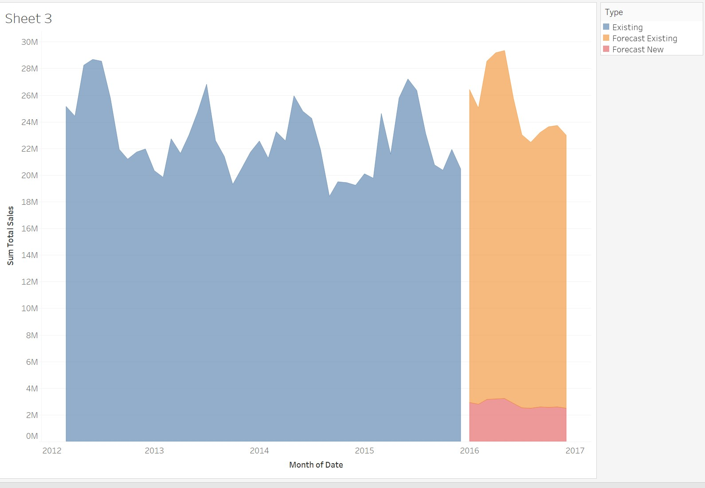

**References**

Decision Tree

https://help.alteryx.com/10.0/index.htm#rpart.htm%3FTocPath%3DTools%7CPredictive%7C_____7

Forest Model 

https://help.alteryx.com/10.0/index.htm#randomForest.htm%3FTocPath%3DTools%7CPredictive%7C_____8

Boosted Model

https://help.alteryx.com/10.0/index.htm#Boosted_Model.htm

F1 score

https://en.wikipedia.org/wiki/F1_score
